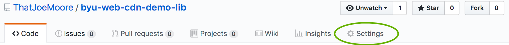
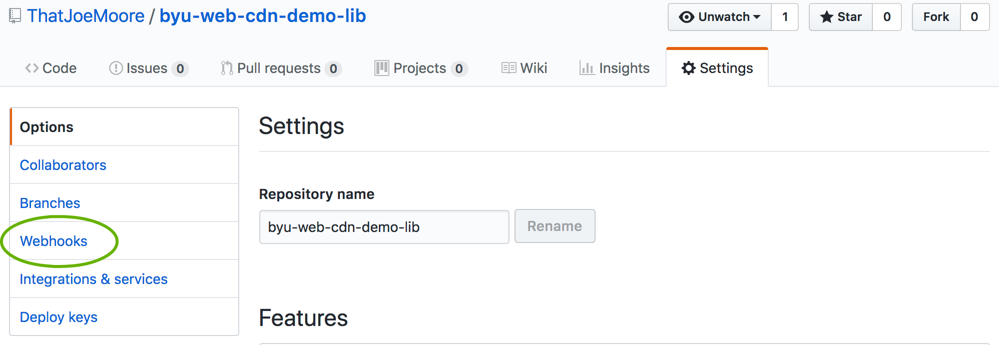
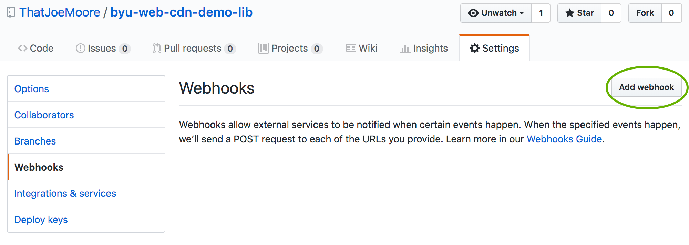
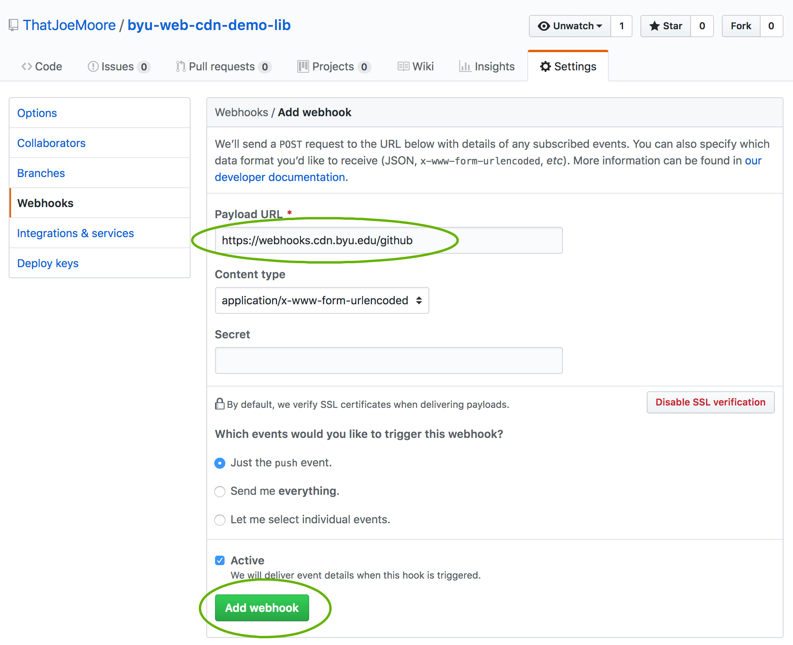
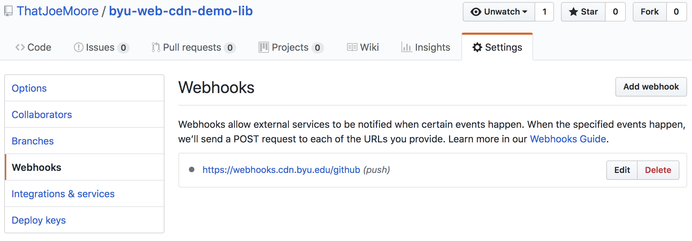
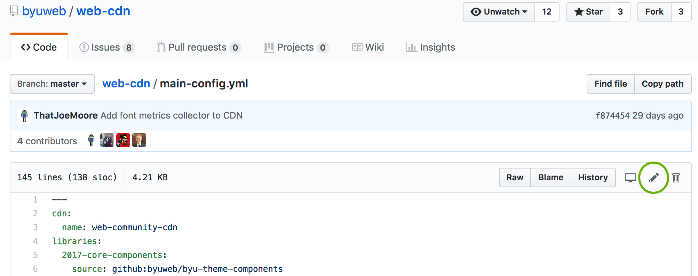
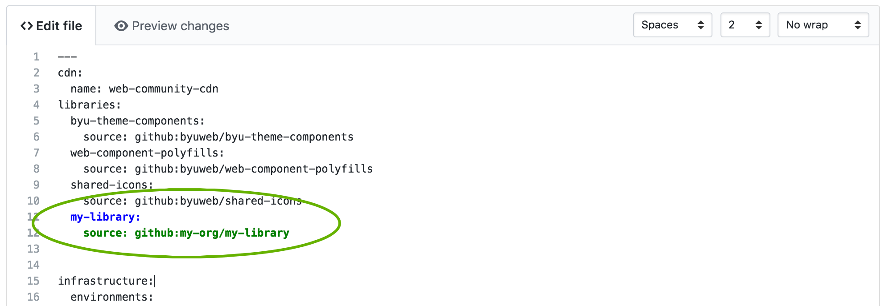
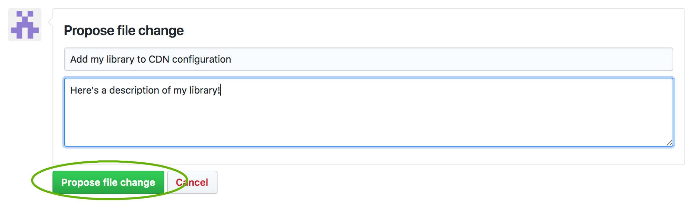

# Adding Libraries to the CDN

To add a library to the CDN, you need to perform the following steps:

1. [Add a CDN configuration file](#add-a-cdn-configuration-file)
2. [Add a Github webhook](#add-a-github-webhook)
3. [Create a pull request in the CDN repository](#create-a-pull-request-in-the-cdn-repository)

# Add a CDN configuration file

The CDN is configured using a file called `.cdn-config.yml`, which must be located in the root directory of your
Github repository.

Here's the most simple version of this file:

```yaml

---
$config-version: 1 # Tells the CDN how to interpret this file
name: My Fancy Library
description: A semi-long description of what this library does
type: javascript # Available types: 'web-component', 'javascript', 'stylesheet', 'font', 'images', 'other'. Defaults to 'unknown'

```

## Specifying which files to include

The example configuration will include everything in your repository. Most often, this is not what we want.
Usually, we have a set of source files and a set of concatenated, minified files we want to actually serve.

Currently, the CDN requires that these files be checked into your source repository 
(see [this issue](https://github.com/byu-oit/web-cdn/issues/18) for the work needed to change that). However,
we probably don't want the source files to be in the CDN, just the assembled files.  So, the CDN allows us to
decide which files to include.

To filter included files, you need to include a `resources:` section in your configuration file:

```yaml

resources:
  - my-production-file.js
  - my-production-file.min.js
  - my-production-file.js.map # Include sourcemaps to make debugging easier!
  - my-production-file.min.js.map
  
```

Listing all of your files individually can be a pain.  Instead, you can use
[Glob Patterns](https://www.npmjs.com/package/glob#glob-primer) to include multiple files:

```yaml

resources:
  - my-production-file*.js*
  
```

This will grab all of the files that were listed in the first example.

Instead of keeping your files in the root of your repository, it's common to put them in another directory,
like `dist/`.  You probably don't want to force your users to include `dist/` in their URL, so you can ask
the CDN to move files around for you:

```yaml

resources:
  - src: dist/**
    dest: ./
  
```

This will move all of the contents of `dist/` to the root folder on the CDN. You can also use this pattern to rename
directories:

```yaml

resources:
  - src: my-dir/**
    dest: other-dir/
  
```

If you want to rename the individual files in a Glob path, you can add rename rules. These use a regular expression
to match and rename files.

```yaml

resources:
  - src: my-dir/**
    dest: other-dir/ 
    rename:
      - regex: foo(\.min)?\.js
        to: bar$1.js

```

Given a filesystem like this:

- my-dir/
  - foo.js
  - foo.min.js
  
The result would look like:

- other-dir/
  - bar.js
  - bar.min.js
  
## Documenting how to use your library (TODO)

> While the CDN does not currently offer any user-friendly UIs, one is in the works. Any documentation information
> will be presented in the future CDN UI.

TODO: Document `docs:`, `basic_usage:`, and demos, as soon as they're actually implemented.


# Add a Github webhook

> This step requires that you have administrator access to your repository. If this is not the case,
> you will have to contact someone who has the appropriate permissions.

In order for the CDN to be notified of when you push new code to your repository, you must add a [Webhook](https://help.github.com/articles/about-webhooks/).

First, open your repository settings:



> If you can't see the 'Settings' option, you do not have administrator rights to the repository. You will need to contact
> someone who does.


Once you're in settings, click on "Webhooks."




Now, you need to add a new webhook.




Enter `https://webhooks.cdn.byu.edu/github` into the "Payload URL" field, then click "Add webhook."




Once your webhook is created, you can return to "Settings" to view the status of the webhook and see a record
of all of the calls made to it.




# Create a pull request in the CDN repository

Now, we need to let the CDN know that your repository exists.  The CDN is controlled by a central configuration file,
[`main-config.yml`](https://github.com/byu-oit/web-cdn/blob/master/main-config.yml).  You'll need to create a fork
of the CDN repository in order to modify it.

The easiest way to fork and modify the file is using the Github UI. Click [this link](https://github.com/byu-oit/web-cdn/edit/master/main-config.yml)
or navigate to the file and click the edit button:



Then, add your repository's configuration at the end of the 'libraries' section (which will be much longer than
it appears in this image):



The key for this configuration ('my-library', shown in <span style="color: blue; font-weight: bolder">blue</span>) 
is the name your library will have in the CDN.  This will be first part of the URL consumers use to reference your 
library.  The 'source' line (shown in <span style="color: green; font-weight: bolder">green</span>) tells the CDN where 
to look for your library.  The format for this value is `github:<repo owner>/<repo name>`.

You may see other values associated with other libraries in the configuration. Don't worry about those; if they're needed,
the team behind the CDN will add them.  All your library needs is its name and the source.

Once you're done, scroll to the bottom to create a pull request with these changes.



Now, you're done! The Web Community engineering group will review and approve your Pull Request, and your library will
be included in the CDN.

# Pushing to the CDN

The CDN's layout is driven by the branches and tags in your git repository.

## Git Tags

The URL for tags looks like this:

`https://cdn.byu.edu/{library name}/{tag name}/{path to file}`

If your tag name begins with 'v' and is followed by a valid [Semantic Version](https://semver.org), the 'v' will be 
omitted from the URL. For example, 'v1.2.3' will appear as '1.2.3' in the URL.

Most users should reference files in your library using tags. The CDN knows that tags are usually immutable, and will
serve files from tags with long-lasting `Cache-Control` values, so that users will usually have the files cached already.

Once a tag as been included in the CDN, the assembler will not remove the tag's files, even if the tag is deleted from
Git. If you need to remove a tag from the CDN, please contact the Web Community Engineering Group.

## Git Branches

In order to aid your development process, the CDN will also serve the contents of all of your git branches.  The path
to load a file from a branch looks like:

`https://cdn.byu.edu/{library name}/experimental/{git branch name}/{path to file}`

Branches are served with relatively short cache times. Be aware, however, that due to the nature of the high-performance 
infrastructure underlying the CDN, changes made to branches may take several minutes to appear in the CDN.

## Aliases

In addition to explicit version numbers, users can reference 'aliases' which are dynamically updated to point to certain
tags.  For more information, see the [Alias Documentation](./aliases.md).
