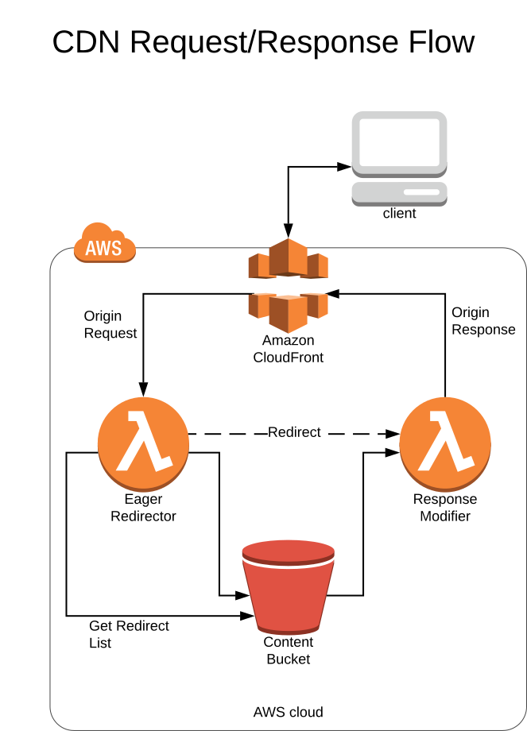

# Serving Files

The CDN serves requests from Amazon CloudFront, backed by an Amazon S3 Bucket.

# Overview

# Cloudfront

[Amazon Cloudfront](https://aws.amazon.com/cloudfront/) is a global Content Delivery Network. Instead of serving
requests from a server in one datacenter, CloudFront sits between the user and the server and serves cached files
from a global network of data centers.  We leverage CloudFront to provide HTTPS termination, HTTP/2 support, 
compression of responses, and distributed caching of resources.

When a user requests a file from cdn.byu.edu, their request will be routed to the nearest 
[CloudFront Edge location](https://aws.amazon.com/cloudfront/details/#edgelocations), which will check its regional
cache to see if the file has already been loaded. If not, Cloudfront will make a request to the content S3 Bucket and
load the file.

# S3 Bucket

Files are pushed into the S3 bucket by the [Assembler](./assembling-files.md).

# Handling Redirects

Some requests, such as [CDN Aliases](aliases.md), will result in a redirect. If we know beforehand that a certain
URL will be redirected, we can improve load times by performing that redirect without going all the way back to
the Content S3 bucket. For use cases like this, CloudFront offers a feature called Lambda@Edge, which allows us
to execute code at the edge location to transform the request.

When a request comes to CloudFront for a URL that has not been cached, CloudFront will invoke the Eager Redirect
lambda function.  This lambda knows which paths need to be redirected, and, if the request matches a redirected
path, will immediately instruct CloudFront to redirect the user to that location. CloudFront will then cache that
response, so the next request to that path will not need to invoke the lambda.

# Customizing Responses

There are some features that we want to support that the combination of CloudFront and S3 don't know how to support.
For example, we can see major performance gains by sending 
[Preload Links](https://developer.mozilla.org/en-US/docs/Web/HTML/Preloading_content) with certain responses. In
order to add support for features like this, we use an 'Response Enhancer' lambda function, which will add or modify
the response headers.  The modified headers will be cached by CloudFront so that the next request to the URL will
not need to invoke the lambda function.

